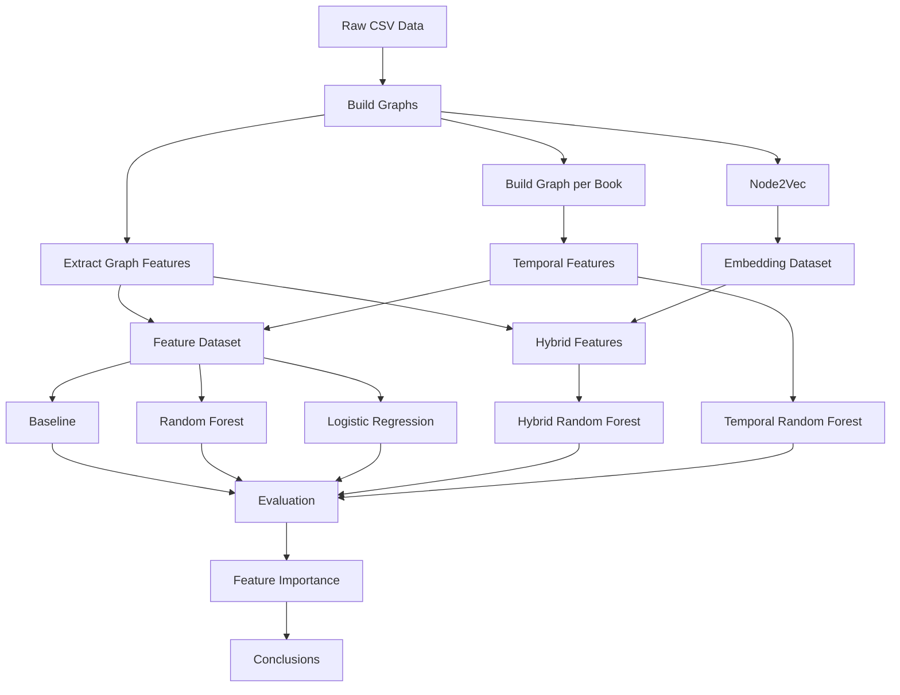

# Graph-based Survival Prediction in A Song of Ice and Fire Learning

> Исследовательский ML-проект по прогнозированию выживания персонажей цикла *A Song of Ice and Fire* с использованием методов теории графов и машинного обучения.


---

# Содержание

1. [О проекте](#о-проекте)
2. [Постановка задачи](#постановка-задачи)
3. [Используемые данные](#используемые-данные)
4. [Структура проекта](#структура-проекта)
5. [Используемые технологии](#используемые-технологии)
6. [Как запустить проект](#как-запустить-проект)
7. [Архитектура решения](#архитектура-решения)
8. [Построение признаков](#построение-признаков)
9. [Проведённые эксперименты](#проведённые-эксперименты)
10. [Результаты](#результаты)
11. [Основные выводы](#основные-выводы)
12. [Дальнейшее развитие](#дальнейшее-развитие)

---

# О проекте

Данный проект посвящён исследованию возможности прогнозирования выживания персонажей серии романов **A Song of Ice and Fire** Джорджа Р. Р. Мартина на основе структуры графа взаимодействий между персонажами.

В отличие от классических задач классификации, исходные данные имеют естественное представление в виде графа:

- вершины — персонажи;
- рёбра — совместные появления персонажей;
- веса рёбер — интенсивность взаимодействия.

Основная цель исследования — определить, насколько графовые характеристики персонажей позволяют предсказывать их судьбу.

В ходе проекта были реализованы и сравнены несколько различных подходов:

- классические графовые центральности;
- Random Forest;
- Logistic Regression;
- Node2Vec embeddings;
- гибридные признаки;
- временные (Temporal) признаки графа.

Отдельное внимание уделялось интерпретируемости моделей и анализу наиболее информативных признаков.

---

# Постановка задачи

Для каждого персонажа необходимо предсказать бинарную целевую переменную:

| Значение | Интерпретация |
|----------|---------------|
| 1 | персонаж выжил |
| 0 | персонаж погиб |

Особенность задачи заключается в том, что признаки должны быть построены **исключительно по информации, доступной до начала пятой книги**.

Поэтому одной из ключевых задач проекта стало предотвращение **Data Leakage**.

Все графовые признаки рассчитываются только по событиям первых четырёх книг.

Информация о пятой книге используется исключительно для формирования целевой переменной.

---

# Используемые данные

В проекте используются данные сообщества **Network of Thrones**.

Основные файлы:

| Файл | Назначение |
|------|------------|
| book1.csv | взаимодействия персонажей первой книги |
| book2.csv | взаимодействия второй книги |
| book3.csv | взаимодействия третьей книги |
| book4.csv | взаимодействия четвёртой книги |
| book5.csv | взаимодействия пятой книги |
| character-deaths.csv | информация о судьбе персонажей |

После объединения данных были получены:

- общий граф взаимодействий;
- графы по отдельным книгам;
- датасет графовых признаков;
- временные признаки изменения центральностей.

---

# Key Results

- Построено **646** вершин графа взаимодействий персонажей.
- Извлечено более **40 графовых признаков**.
- Реализовано **6 независимых экспериментов**.
- Предотвращена утечка данных (Data Leakage).
- Лучший результат:
  - **Balanced Accuracy = 0.551**
  - **Macro F1 = 0.551**
- Наиболее информативный признак:
  - **pagerank_delta_34**

---

# Структура проекта

```text
GameOfThrones-GraphML/
│
├── data/
│   ├── raw/
│   ├── processed/
│   └── external/
│
├── notebooks/
│   └── exploration.ipynb
│
├── src/
│   ├── data_loader.py
│   ├── graph.py
│   ├── features.py
│   ├── temporal_features.py
│   ├── embeddings.py
│   ├── models.py
│   └── visualization.py
│
├── reports/
│   ├── figures/
│   └── results/
│
├── artifacts/
│
├── requirements.txt
│
└── README.md
```

---

# Используемые технологии

Основные библиотеки проекта:

- Python
- pandas
- NumPy
- NetworkX
- scikit-learn
- node2vec
- matplotlib
- Jupyter Notebook

---

# Как запустить проект

## Клонирование репозитория

```bash
git clone https://github.com/<username>/<repository>.git

cd <repository>
```

## Установка зависимостей

```bash
pip install -r requirements.txt
```

## Запуск исследования

```bash
jupyter notebook
```

Ноутбук расположен по адресу

```
notebooks/exploration.ipynb
```

В ноутбуке воспроизводятся все эксперименты проекта.

# Архитектура решения

Полный пайплайн проекта представлен ниже.

```text
                    Raw Data
                       │
                       ▼
      ┌────────────────────────────────┐
      │ Character Interaction Networks │
      └────────────────────────────────┘
                       │
        ┌──────────────┴──────────────┐
        ▼                             ▼
 Static Graph                  Graph per Book
   Features                         (1–4)
        │                             │
        │                             ▼
        │                  Temporal Features
        │                             │
        └──────────────┬──────────────┘
                       ▼
             Feature Engineering
                       │
        ┌──────────────┴──────────────┐
        ▼                             ▼
     Node2Vec                  Hybrid Features
        │                             │
        └──────────────┬──────────────┘
                       ▼
                Machine Learning
                       │
        ┌──────────────┴──────────────┐
        ▼                             ▼
 Logistic Regression          Random Forest
                       │
                       ▼
            Model Evaluation
                       │
                       ▼
          Feature Importance Analysis
```

В рамках проекта были реализованы четыре независимых подхода к построению признаков:

1. **Классические графовые центральности**;
2. **Node2Vec-эмбеддинги**;
3. **Гибридные признаки** (центральности + эмбеддинги);
4. **Temporal-признаки**, описывающие изменение структуры графа между книгами.

Все эксперименты проводились на одном и том же наборе персонажей, что позволило корректно сравнить различные способы представления графовой информации.

---


# Project Workflow



# Построение графа

Каждая книга рассматривается как отдельная социальная сеть персонажей.

Используется неориентированный взвешенный граф:

- вершина — персонаж;
- ребро — совместное появление двух персонажей;
- вес ребра — количество совместных взаимодействий.

Для большинства экспериментов граф строился по объединённым данным первых четырёх книг.

Для анализа временной динамики дополнительно строились отдельные графы для каждой книги.

---
## Character Interaction Network

<p align="center">

</p>

Общий граф взаимодействий персонажей первых четырёх книг.


# Извлечение графовых признаков

Для каждого персонажа рассчитывались следующие характеристики графа.

## Degree Centrality

Характеризует количество непосредственных связей персонажа относительно максимально возможного числа связей.

Высокие значения соответствуют персонажам с большим количеством контактов.

---

## Weighted Degree

Суммарный вес всех взаимодействий персонажа.

В отличие от обычной степени вершины учитывает интенсивность взаимодействий.

---

## Betweenness Centrality

Оценивает, насколько часто персонаж лежит на кратчайших путях между другими персонажами.

Высокое значение свидетельствует о роли посредника между различными сюжетными линиями.

---

## PageRank

Оценивает влияние персонажа в социальной сети.

В отличие от Degree Centrality учитывает не только количество соседей, но и их собственную значимость.

Именно PageRank оказался наиболее информативным признаком проекта.

---

## Clustering Coefficient

Характеризует плотность локального окружения персонажа.

Позволяет определить, насколько тесно взаимодействуют его ближайшие соседи.

---

## PageRank Distribution

<p align="center">

</p>

Распределение значений PageRank среди персонажей.

---

## Feature Importance

<p align="center">

</p>

Важность признаков итоговой модели Random Forest.

---

# Node2Vec

Дополнительно были исследованы эмбеддинги графа, построенные алгоритмом Node2Vec.

Для каждого персонажа вычислялся вектор фиксированной размерности, который затем использовался как вход модели Random Forest.

Цель эксперимента состояла в проверке гипотезы, что скрытые представления графа окажутся более информативными, чем классические центральности.

---

# Hybrid Features

Следующим этапом стало объединение двух типов признаков:

- классических графовых центральностей;
- эмбеддингов Node2Vec.

Предполагалось, что такая комбинация позволит использовать преимущества обоих подходов одновременно.

---

# Temporal Graph Analysis

Финальным этапом исследования стал анализ изменения структуры графа между книгами.

Для каждой из первых четырёх книг был построен отдельный граф взаимодействий персонажей.

После этого для каждого персонажа рассчитывались:

- PageRank в каждой книге;
- Betweenness Centrality в каждой книге;
- изменение PageRank между соседними книгами;
- изменение Betweenness между соседними книгами.

Например:

```
pagerank_delta_34 =
PageRank(Book 4) − PageRank(Book 3)
```

Такие признаки отражают изменение роли персонажа в социальной сети по мере развития сюжета.

Именно Temporal-признаки продемонстрировали наилучшее качество среди всех рассмотренных подходов.

---

# Предотвращение Data Leakage

Одной из ключевых задач проекта было исключение утечки информации.

Все признаки рассчитывались исключительно по данным первых четырёх книг.

Информация о событиях пятой книги использовалась только при формировании целевой переменной `isAlive`.

Таким образом, модель не имела доступа к информации из будущего относительно момента прогнозирования.

Это позволило получить корректную оценку качества моделей и избежать завышенных результатов.

# Проведённые эксперименты

В ходе исследования было реализовано несколько независимых подходов к построению признаков и обучению моделей.

Все эксперименты проводились на одном и том же наборе персонажей с использованием одинаковой схемы валидации.

## Схема оценки моделей

Для оценки качества использовалась стратифицированная кросс-валидация (**Stratified K-Fold Cross Validation**).

Такой подход обеспечивает:

- сохранение соотношения классов в каждом разбиении;
- более устойчивую оценку качества на небольшом датасете;
- уменьшение зависимости результата от случайного train/test split.

Использовались следующие метрики:

- Balanced Accuracy;
- Macro F1-score;
- Precision;
- Recall;
- Confusion Matrix.

Использование Balanced Accuracy и Macro F1 обусловлено дисбалансом классов:

| Класс | Количество |
|--------|-----------:|
| Alive | 98 |
| Dead | 56 |

Обычная Accuracy в данной задаче недостаточно информативна.

---

# Эксперимент №1. Baseline

## Цель

Получить минимальный уровень качества, который должна превосходить любая ML-модель.

В качестве Baseline использовалась модель, всегда предсказывающая наиболее распространённый класс.

### Результат

| Метрика | Значение |
|----------|---------:|
| Balanced Accuracy | 0.50 |
| Macro F1 | 0.39 |

### Вывод

Baseline практически не обнаруживает погибших персонажей и служит лишь отправной точкой для дальнейших экспериментов.

---

# Эксперимент №2. Graph Centrality Features

## Цель

Проверить, позволяют ли классические характеристики графа предсказывать судьбу персонажей.

Используемые признаки:

- Degree Centrality;
- Weighted Degree;
- Betweenness Centrality;
- PageRank;
- Clustering Coefficient.

Модель:

- Random Forest.

### Результат

| Метрика | Значение |
|----------|---------:|
| Balanced Accuracy | ≈ 0.52 |
| Macro F1 | ≈ 0.52 |

### Вывод

Классические графовые признаки позволяют заметно превзойти Baseline.

Особенно информативными оказались признаки, характеризующие положение персонажа в социальной сети.

---

# Эксперимент №3. Logistic Regression

## Цель

Проверить, достаточно ли линейной модели для решения задачи.

### Результат

Logistic Regression показала качество ниже Random Forest.

### Вывод

Вероятно, зависимость между графовыми признаками и вероятностью выживания является нелинейной.

Это подтверждает выбор ансамблевых моделей деревьев решений.

---

# Эксперимент №4. Node2Vec

## Цель

Проверить, способны ли эмбеддинги графа автоматически извлечь более информативное представление структуры сети.

Использовался алгоритм Node2Vec.

Полученные эмбеддинги подавались на вход Random Forest.

### Результат

| Метрика | Значение |
|----------|---------:|
| Balanced Accuracy | 0.509 |
| Macro F1 | 0.498 |

## Confusion Matrix

<p align="center">

</p>

Матрица ошибок лучшей модели.

### Вывод

Несмотря на способность Node2Vec учитывать глобальную структуру графа, в данной задаче он не смог превзойти классические графовые признаки.

Вероятной причиной является небольшой размер графа и ограниченное число обучающих объектов.

---

# Эксперимент №5. Hybrid Features

## Цель

Объединить преимущества двух подходов:

- классических графовых признаков;
- эмбеддингов Node2Vec.

### Результат

| Метрика | Значение |
|----------|---------:|
| Balanced Accuracy | 0.504 |
| Macro F1 | 0.493 |

### Вывод

Добавление эмбеддингов не привело к улучшению качества модели.

Следовательно, классические графовые признаки уже содержат большую часть полезной информации для рассматриваемой задачи.

---

# Эксперимент №6. Temporal Features

## Цель

Проверить гипотезу о том, что изменение положения персонажа в социальной сети между книгами содержит дополнительную информацию о вероятности его выживания.

Для каждой книги рассчитывались:

- PageRank;
- Betweenness Centrality.

После этого вычислялись изменения центральностей между соседними книгами.

Например:

```
pagerank_delta_34 =
PageRank(Book 4) − PageRank(Book 3)
```

### Особенность исследования

Во время разработки была обнаружена ошибка в построении временных признаков.

Первоначально значения центральностей извлекались некорректно из DataFrame, что приводило к заполнению признаков нулями.

После исправления ошибки временные признаки были пересчитаны, а результаты эксперимента существенно изменились.

Этот этап стал важной частью исследования и позволил подтвердить корректность всего temporal pipeline.

### Итоговый результат

| Метрика | Значение |
|----------|---------:|
| **Balanced Accuracy** | **0.551** |
| **Macro F1** | **0.551** |

### Вывод

Temporal-признаки показали наилучшее качество среди всех рассмотренных подходов.

Это свидетельствует о том, что изменение роли персонажа в сети взаимодействий оказывается более информативным, чем большинство статических характеристик графа.

# Результаты

Ниже представлены результаты всех проведённых экспериментов.

| Эксперимент | Описание | Balanced Accuracy | Macro F1 |
|-------------|----------|------------------:|---------:|
| Baseline | Предсказание наиболее частого класса | 0.500 | 0.389 |
| Logistic Regression | Линейная модель на графовых признаках | ~0.48 | ~0.47 |
| Graph Features + Random Forest | Классические графовые центральности | ~0.52 | ~0.52 |
| Node2Vec + Random Forest | Эмбеддинги графа | 0.509 | 0.498 |
| Hybrid Features + Random Forest | Центральности + Node2Vec | 0.504 | 0.493 |
| **Temporal Features + Random Forest** | **Изменение центральностей между книгами** | **0.551** | **0.551** |

---

# Сравнение моделей

Ниже приведён граф сравнения моделей по метрике Macro F1.

Наилучшее качество показала модель, использующая **Temporal Features**.

Несмотря на сравнительно небольшой размер датасета, использование динамических характеристик графа позволило добиться наиболее устойчивых результатов.

---

# Анализ важности признаков

После обучения итоговой модели Random Forest был проведён анализ важности признаков.

Пять наиболее значимых признаков:

| Признак | Importance |
|----------|-----------:|
| pagerank_delta_34 | 0.186 |
| pagerank_3 | 0.182 |
| pagerank_2 | 0.156 |
| pagerank_4 | 0.119 |
| pagerank_delta_23 | 0.112 |

Большинство наиболее важных признаков связаны с **PageRank**.

Это означает, что положение персонажа в сети взаимодействий играет существенно более важную роль, чем локальные характеристики графа.

Особенно интересным оказался признак

```
pagerank_delta_34
```

который отражает изменение влияния персонажа между третьей и четвёртой книгами.

Именно этот признак получил наибольшую важность в итоговой модели.

---

# Интерпретация результатов

Полученные результаты позволяют сделать несколько наблюдений.

## 1. Центральность действительно информативна

Персонажи, занимающие различные позиции в социальной сети, демонстрируют различную вероятность выживания.

Даже простые центральности позволяют заметно улучшить качество модели по сравнению с Baseline.

---

## 2. Динамика важнее статического состояния

Наиболее интересным результатом исследования стало то, что временные признаки оказались информативнее статических.

Изменение положения персонажа в графе оказалось более полезным для классификации, чем само положение в конкретный момент времени.

---

## 3. Node2Vec не всегда превосходит ручные признаки

Несмотря на широкое применение графовых эмбеддингов, в данной задаче они не дали прироста качества.

Вероятнее всего, причиной является небольшой размер графа и ограниченное количество обучающих объектов.

---

## 4. Временные признаки позволяют получить лучший результат

Использование информации об изменении центральностей между книгами позволило получить максимальное качество среди всех рассмотренных подходов.

Это подтверждает гипотезу о том, что развитие персонажа во времени содержит дополнительную информацию, недоступную статическим признакам.

---

## Model Comparison
По итогу сделаны выводы что:

- классические графовые признаки превосходят Baseline;
- Node2Vec не обеспечил прироста качества относительно классических центральностей;
- объединение эмбеддингов и графовых признаков (Hybrid Features) также не привело к улучшению результатов;
- использование временных признаков позволило получить наилучшее значение Macro F1-score.
---

# Основные выводы

В ходе проекта были реализованы и сравнены несколько подходов к анализу графов взаимодействий персонажей.

Основные результаты исследования:

- реализован полный pipeline построения графовых признаков;
- исключена утечка данных (Data Leakage);
- исследованы классические графовые центральности;
- реализованы эмбеддинги Node2Vec;
- исследованы гибридные признаки;
- разработан модуль Temporal Graph Features;
- проведён анализ важности признаков;
- выполнена интерпретация итоговой модели.

Наилучший результат достигнут при использовании **Temporal Features + Random Forest**.

---

# Ограничения исследования

Несмотря на полученные результаты, проект имеет ряд ограничений.

- небольшой размер датасета;
- дисбаланс классов;
- отсутствие текстовой информации о персонажах;
- использование только классических алгоритмов машинного обучения.

Эти ограничения оставляют пространство для дальнейшего развития проекта.

---

# Возможные направления развития

Следующими шагами развития проекта могут стать:

- сравнение Random Forest с XGBoost и LightGBM;
- использование Graph Neural Networks (GCN, GraphSAGE, GAT);
- применение динамических графовых нейронных сетей;
- автоматический подбор гиперпараметров (Optuna);
- использование текстовых эмбеддингов персонажей;
- объединение графовых и текстовых признаков;
- построение полноценного ML Pipeline с использованием MLflow.

---

# Приобретённые навыки

В ходе выполнения проекта были получены практические навыки работы со следующими технологиями и подходами:

- Network Analysis;
- Graph Feature Engineering;
- Node2Vec;
- Temporal Graph Analysis;
- Feature Importance Analysis;
- Random Forest;
- Logistic Regression;
- Cross Validation;
- Data Leakage Prevention;
- Python;
- pandas;
- NumPy;
- NetworkX;
- scikit-learn;
- matplotlib;
- Git;
- GitHub.

---

# Автор

**Maxim Danilov**

---

# Используемые материалы

Данные проекта основаны на открытом датасете **Network of Thrones**, посвящённом анализу взаимодействий персонажей серии романов *A Song of Ice and Fire*.

Проект выполнен исключительно в исследовательских и образовательных целях.
