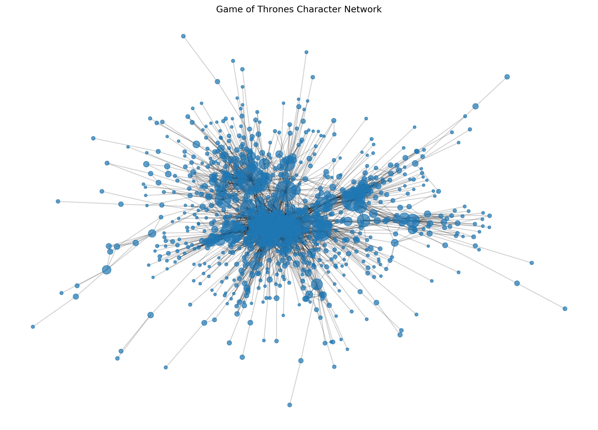
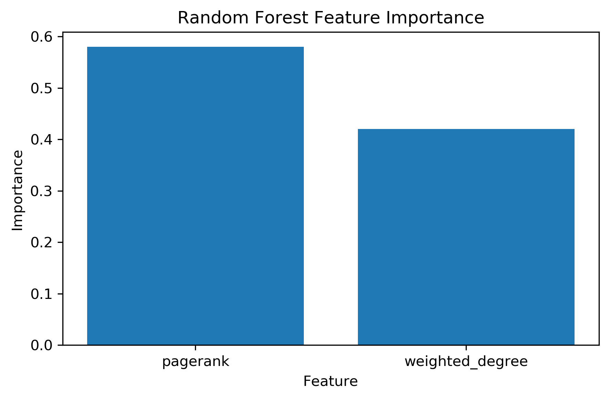
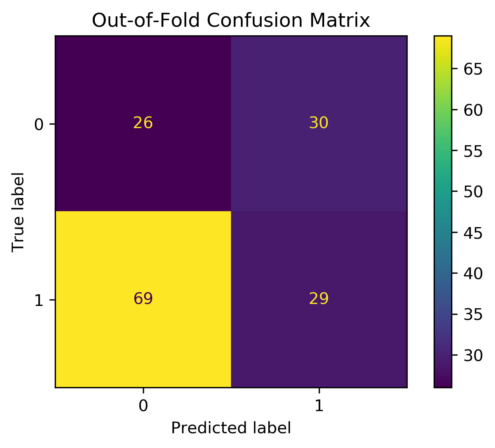
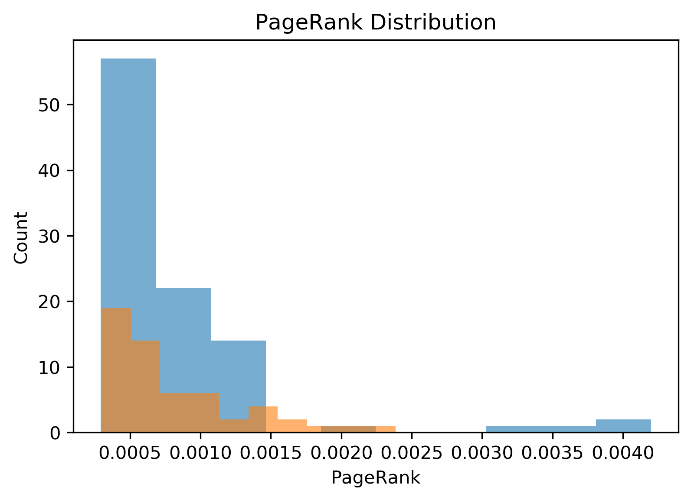

# Предсказание выживания персонажей Game of Thrones

<br>
<br>

Проект посвящён анализу сети взаимодействий персонажей из серии книг *Game of Thrones* и предсказанию выживания персонажей с использованием графовых методов машинного обучения.

<br>

Основные задачи проекта:<br>
- построение графа взаимодействий персонажей,
- извлечение графовых признаков,
- классификация выживания персонажей,
- работа с несбалансированными классами,
- оценка моделей с помощью кросс-валидации.

---
<br>

# Датасет

<br>
<br>

Датасет состоит из:
<br>
- файлов взаимодействий персонажей для 5 книг,
- метаданных персонажей (`nodes.csv`),
- весов взаимодействий между персонажами.

<br>

Каждая вершина графа — пeрсонаж.  
Рёбра графа отражают взаимодействия между персонажами.
<br>
Целевая переменная:

```text
isAlive
```

где:
- `1` — персонаж выжил,
- `0` — персонаж погиб.

---

# Структура проекта <br>

```text
project/
│
├── data/
│   ├── book1.csv
│   ├── book2.csv
│   ├── book3.csv
│   ├── book4.csv
│   ├── book5.csv
│   └── nodes.csv
│
├── notebooks/
│   └── exploration.ipynb
│
├── src/
    ├── __init__.py
│   ├── data_loader.py
│   ├── graph.py
│   ├── features.py
│   └── models.py
│
├── artifacts/
│   ├── final_model.joblib
│   ├── final_feature_columns.joblib
│   ├── model_comparison.csv
│   └── dataset_4.csv
│
├── requirements.txt
├── README.md
└── .gitignore
```

---

# Построение графа

<br>
<br>

Граф взаимодействий персонажей строится с использованием библиотеки `NetworkX`.
<br>
- Вершины графа — персонажи.
- Рёбра — взаимодействия между персонажами.
- Вес ребра отражает частоту взаимодействий.

Финальный граф строится только по книгам 1–4, чтобы избежать утечки данных (data leakage).

---
<br>

# Извлечение признаков
<br>
<br>
Из графа были извлечены следующие признаки:

- Degree Centrality
- Weighted Degree
- Betweenness Centrality
- PageRank
- Clustering Coefficient

Извлечение признаков реализовано в:

```text
src/features.py
```

---
<br>

# Модели машинного обучения

<br>
<br>
В проекте были исследованы следующие модели:

- Majority-class baseline
- Logistic Regression
- Random Forest

Для оценки качества использовались:

- Stratified 5-Fold Cross Validation
- Macro F1-score
- Balanced Accuracy
- Recall для миноритарного класса

---
<br>

# Отбор признаков
<br>
<br>

Анализ важности признаков показал, что наиболее информативными признаками являются:

- PageRank
- Weighted Degree

Компактные наборы признаков показали более устойчивые результаты, чем использование всех графовых метрик одновременно.

---
<br>

# Результаты

<br>
<br>

## Финальная модель

<br>

```text

Random Forest

```
<br>

## Финальные признаки

<br>

```text

    pagerank
    weighted_degree

```

# Визуализации
<br>
<br>

## Graph Visualization

<br>



---

<br>

## Feature Importance

<br>



---

<br>

## Confusion Matrix



---

<br>

## PageRank Distribution



## Основные выводы
<br>
<br>

- Графовые признаки содержат полезный сигнал для предсказания выживания персонажей.
- Наиболее информативными оказались PageRank и weighted degree.
- Random Forest обеспечил лучший баланс между качеством классификации и обнаружением миноритарного класса.
- Baseline-модель показала высокую accuracy, но полностью провалилась в обнаружении смертей персонажей.

---
<br>

# Пример метрик

<br>
<br>

```text
Macro F1-score: ~0.52
Accuracy: ~0.56
```

Датасет является небольшим и несбалансированным, поэтому основное внимание уделялось macro-метрикам, а не accuracy.

---
<br>

# Визуализации

<br>
<br>

Проект включает:
- визуализацию графа персонажей,
- графики важности признаков,
- confusion matrix,
- анализ распределений признаков.

---
<br>

# Используемые технологии

<br>
<br>

- Python
- pandas
- NumPy
- NetworkX
- scikit-learn
- matplotlib
- Jupyter Notebook

---
<br>

# Как запустить проект

<br>
<br>

## Установка зависимостей

<br>

```bash
pip install -r requirements.txt
```
<br>

## Запуск Jupyter Notebook

<br>
<br>

```bash
jupyter notebook
```

Открыть:
<br>

```text
notebooks/exploration.ipynb
```

---

# Возможные улучшения
<br>
<br>
Дальнейшее развитие проекта может включать:
- Node2Vec embeddings,
- Graph Neural Networks,
- Temporal Graph Analysis,
- XGBoost / LightGBM,
- предсказание выживания между книгами.

---
<br>

### Автор

<br>

Maxim Danilov